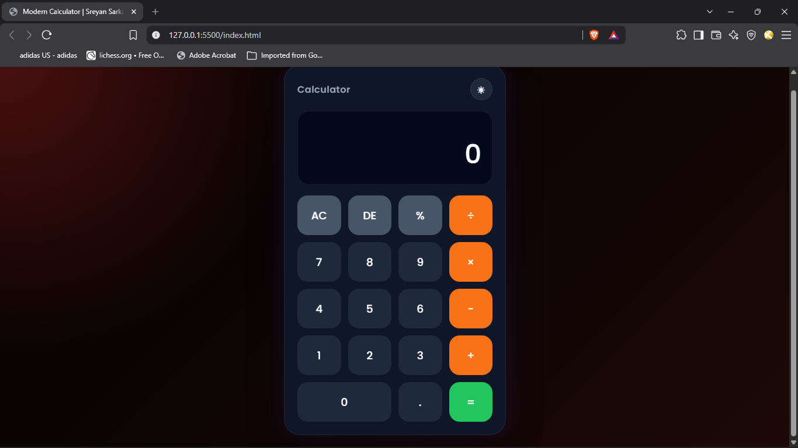

````md
# 🧮 Modern Calculator

A sleek, responsive, and interactive calculator built using **HTML, CSS, and JavaScript**.  
This project demonstrates clean UI design, smooth user experience, and core JavaScript logic implementation.

---

## 🚀 Features

- ✅ Basic arithmetic operations (+, −, ×, ÷)
- ✅ Clear (C) and Delete (⌫) functionality
- ✅ Responsive design for all devices
- ✅ Smooth button animations
- ✅ Keyboard-friendly structure (optional enhancement)
- ✅ Clean and modern UI

---

## 🛠️ Tech Stack

- HTML5
- CSS3
- JavaScript

---

## 📂 Project Structure

Modern-Calculator/
├── assets/
│   └── Calculator.png
├── index.html
├── style.css
├── script.js
└── README.md

---

## 📸 Preview



---

## ⚙️ How to Run This Project

1. Clone the repository:
```bash
git clone https://github.com/SREYAN-SARKAR/Modern-Calculator.git
````

2. Navigate to the project folder:

```bash
cd Modern-Calculator
```

3. Open `index.html` in your browser.

---

## 🎯 Learning Outcomes

* DOM manipulation using JavaScript
* Event handling for buttons
* UI/UX design principles
* Responsive layout creation
* Real-world project structuring

---

## 🌟 Future Improvements

* Add dark/light mode toggle
* Add scientific calculator functions
* Add keyboard input support
* Add calculation history feature

---

## 👨‍💻 Author

**Sreyan Sarkar**

* GitHub: [SREYAN-SARKAR](https://github.com/SREYAN-SARKAR)

---

## 📜 License

This project is open-source and free to use for learning purposes.

```
